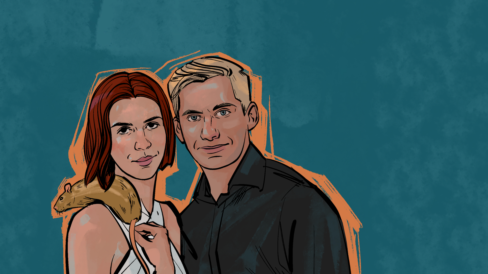
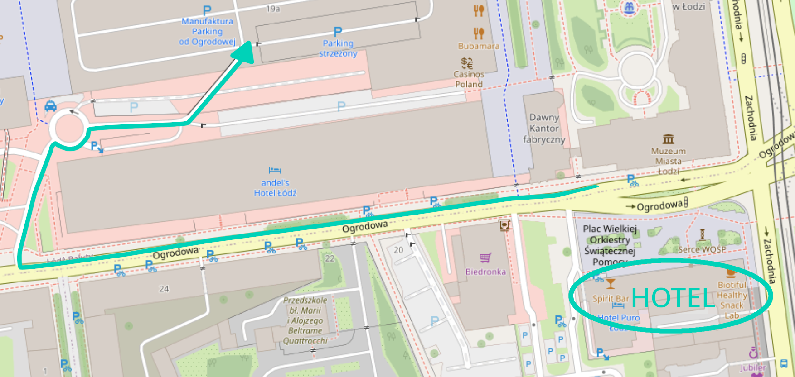
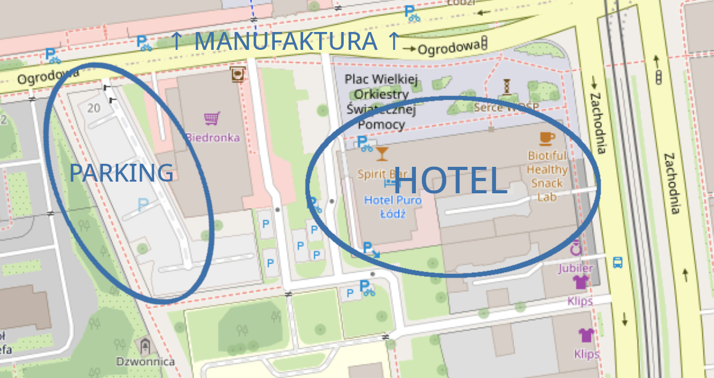

import "./noheader.css"

## Podstawowe informacje

Ślub oraz weselne cocktail party odbędą się w sobotę 3. czerwca w [hotelu PURO](https://purohotel.pl/pl/lodz/) w Łodzi.

* 15:00 humanistyczna ceremonia ślubu w [sali Popcorn](https://purohotel.pl/pl/lodz/sale-konferencyjne/) na I piętrze hotelu,
* 15:30-16:00 składanie życzeń przed hotelem,
* 16:00-18:00 obiad w restauracji [Miska](https://purohotel.pl/pl/lodz/restauracje/miska-gastro-bowls/) na parterze hotelu,
* 18:00-1:00 cocktail party w [Spirit Bar](https://purohotel.pl/pl/lodz/restauracje/spirit-bar/) na najwyższym piętrze hotelu,
* ~20:30 tort od [Sugar by Blonde](https://sugarbyblonde.pl/).

Ze strony hotelu otrzymaliśmy gorącą prośbę, aby **nie używać konfetti ani nie sypać ryżu / innych rzeczy**, ani przed hotelem, ani – tym bardziej – w jego wnętrzu.

Prezenty najchętniej przyjmiemy w formie pieniężnej – czy to w kopertach, czy to w formie przelewu na konto (dane niżej). 

## Ślub

Nasza ceremonia będzie miała formę [ślubu humanistycznego](https://pl.wikipedia.org/wiki/%C5%9Alub_humanistyczny). Celebrant najpierw przedstawi to, jak się poznaliśmy oraz przybliży różne fakty na temat naszej relacji. Następnie my wyznamy sobie wzajemnie co do siebie czujemy, wypowiadając tym samym przygotowane przez siebie przysięgi.

## Obiad

Dla gości wesela przygotowaliśmy czterodaniowy obiad – zupa, przystawka, danie główne, deser – do wyboru w wersji mięsnej lub wegańskiej. Jeśli chcecie skorzystać z tej drugiej, a jeszcze nie uzyskaliśmy od Was tej informacji, prosimy o jak najszybszy kontakt. Podobnie jeśli macie **alergie pokarmowe** lub inne wymagania żywieniowe, które powinniśmy uwzględnić. Do obiadu będzie można zamówić napoje bezalkoholowe, wino, albo piwo.

## Cocktail party

Po posiłku zapraszamy do hotelowego Spirit Baru na cocktail party. W przeciwieństwie do większości wesel, nie będzie na stołach butelek wódki. Zamiast tego dostępny będzie open bar, z możliwością zamówienia piwa, wina, szotów, koktajli – w wersjach zarówno alkoholowych jak i bezalkoholowych.

W bufecie będą dla Was przekąski typu fingerfood – słodkie i słone, na zimno i na ciepło. Dodatkowo pojawi się maszyna do popcornu. O godzinie 20:30 pojawi się również tort weselny.

Oprawę muzyczną zapewni DJ współpracujący z hotelem, który sprawnie dobierze muzykę i wzbogaci ją, by lepiej się do niej tańczyło. Będzie też trochę miejsca do tańca, jednak bez typowego dużego parkietu.

Miejsca przy stolikach nie będą przydzielane do osób i będzie ich mniej niż gości. Zachęcamy do korzystania z nich w celu odpoczynku czy też napicia się czegoś na spokojnie, po czym powrotu do tańca lub rozmów na stojąco.

## Księga gości

Na tarasie będzie ustawiona fotościanka z ledowym neonem. Zachęcamy do robienia sobie zdjęć. Przydadzą się one też przy wpisie do księgi gości: dostępna będzie mini drukarka do zdjęć. Aby z niej skorzystać, potrzebna będzie aplikacja na telefon, Polaroid Hi-Print ([Android](https://play.google.com/store/apps/details?id=com.polaroid.printer&hl=en&gl=US) / [iPhone](https://apps.apple.com/us/app/polaroid-hi-print/id1503478198)); zachęcamy do wcześniejszego pobrania jej.

## Prezenty

Jeśli chcecie nam przekazać prezent z okazji ślubu, najchętniej przyjmiemy go w formie pieniężnej – tradycyjnej koperty lub przelewu na konto. Przeznaczymy je na podróż poślubną.

Aleksandra Likońska

45 1140 2004 0000 3502 8371 1019

Oczywiście, jeśli chcecie nas obdarować czymś w formie bardziej namacalnej, też nie odmówimy.

## Dress code

Przede wszystkim chcemy, by było Wam wygodnie i byście się dobrze czuli – tym głównie kierujcie się przy dobieraniu stroju. Jeśli jednak chcecie wskazówek, to na pewno pasować będą stroje koktajlowe, stroje wieczorowe, oraz smart casual, w dowolnej kolorystyce.

## Dojazd / parkowanie

W przypadku dojazdu pociągiem, prawdopodobnie wysiądziecie na dworcu Łódź Fabryczna. Do hotelu PURO najlepiej dostać się autobusem 59 lub taksówką, [Green Cab Taxi](https://www.green-cab.pl/): 42 666 44 44, lub dowolna z aplikacji.

Jeśli zaś dojeżdżacie do Łodzi samochodem, polecamy parking na terenie pobliskiego centrum handlowego Manufaktura (parking bezpłatny):

Uwaga: wcześniej na stronie znajdowała się informacja o parkingu za Biedronką. Niestety wyniknęła ona z nieporozumienia – ten parking jest płatny.

## Pozostałe kwestie

W toaletach będą dostępne „koszyczki ratunkowe” z artykułami podstawowej higieny oraz przydatnymi akcesoriami (agrafka, czyścik do butów, etc.).

W przypadku pytań można się kontaktować z naszymi świadkami: Agnieszką oraz Mateuszem.
