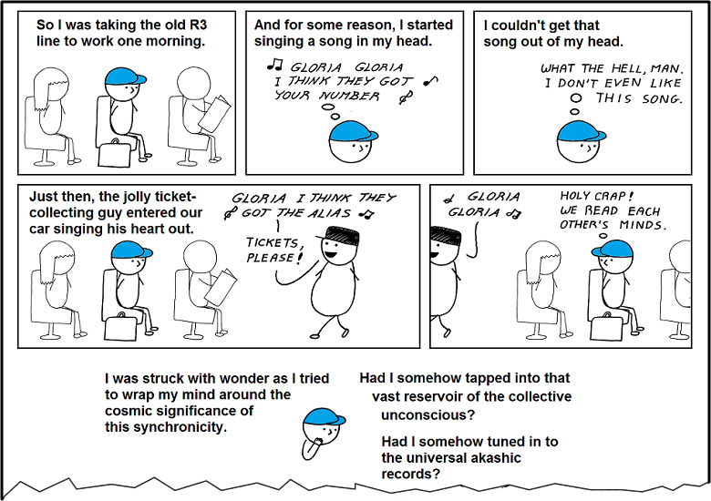

Blogs tend to start with a post about their goals and content to be expected. Consequently, I could write about programming languages and zero-knowledge proofs, type theory and software engineering, or other technical aspects. However, I find the circumstances of its launch much more interesting.

The idea of a personal website, a place to write about things that interest me has been in my head for a long time. I feel a little bit ashamed about how long --- curious ones might check the domain registration date.  Each time I would start working towards that, I dived deep into the search for the best tools, the best aesthetics until the whole thing was becoming boring and I was putting it aside for the indefinite future. It is, naturally, the worst possible strategy --- someone wise wrote that in order to achieve things you need to "do the real thing" [^do-the-real-thing]. It took me some time to learn that lesson.

[^do-the-real-thing]: [Do the Real Thing](https://www.scotthyoung.com/blog/2020/05/04/do-the-real-thing/), Scott H. Young

If you are reading these words though, it seems that I have finally succeeded. I've had plenty of time --- I'm having a planned break from all job activity, a few month-long mini-sabbatical. I decided to do so when I noticed myself experiencing early burnout symptoms: lowered motivation at work, problems focusing on assigned responsibilities, postponing tasks, irritability, failing to see a purpose in activities, and finally something my partner called a "Sunday crash" --- rapid lowering of mood on Sunday evenings.

It was the middle of 2020 when I started noticing first symptoms, though then it was more a bore-out. It is a phenomenon in many ways similar to burnout. However, while the latter is caused mostly by being overloaded with tasks and lack of visible results, bore-out happens when one works below his or her (perceived) skills, often without clear requirements, responsibility boundaries, or even expectations [^boreout]. Despite different roots, the consequences are very similar: lowered motivation, problems with focusing at work, the feeling of stagnation and nonsense of professional activities.

[^boreout]: [Boreout](https://en.wikipedia.org/wiki/Boreout), Wikipedia contributors, _Wikipedia, The Free Encyclopedia_

At that time I wanted to add a twist to my life and do something mentally engaging. I decided to close a long-pending chapter, finish a stage of education --- in 2013 I almost graduated from Master's studies, passing all the required courses. The only thing left was writing a Master's thesis. At the university, I learned that I could be reinstated as a student and do it at last, though I would need to take one additional course, as the curriculum requirements had changed. I asked my employer --- or more precisely the purchaser of my services --- if they agree to reduce contract to part-time  (3 days a week) and they granted my request, which I'm grateful for. In October 2020 I started an academic year. At the same time, soon after my decision, I was offered a promotion --- from Software Developer to Software Architect --- which I accepted. First to see if it's going to work out, then it stayed that way.

I don't regret my decision. I learned a lot during that time, especially in the area of soft skills, finding out what the expectations really are, and documenting the technical choices. However, it seems that when you add lowered work time to extended responsibilities, you get a sure recipe for converting a bore-out into a burnout. I wasn't able to finish all things when planned, I was losing track of the project's direction, sometimes I was working more than the negotiated 3 days a week. It wasn't caused by the client or team pressure --- on the contrary, they encouraged me to maintain a work-life balance. Still, I wanted to finish some things, so I didn't block the rest of the team.

When I noticed clear symptoms of burnout at the beginning of 2021, I decided to quit the project, resign, and have a break. I negotiated with the services purchaser to deliver the first version of the project, which took us till August. And then I was free; free to spend my time on anything I wanted.

---

Even before making my departure formal, I had learned that my decision is in line with a larger trend named The Great Resignation or Big Quit [^the-great-resignation]. During that period an unusually large number of employees decided to send their resignation letters. A considerable share of them were senior employees in their 30s and 40s [^resignation-senior]. Despite the opinions that the phenomenon was exaggerated by the media [^resignation-exaggerated], it definitely existed, and I was a part of it.

[^the-great-resignation]: [Great Resignation](https://en.wikipedia.org/wiki/Great_Resignation), Wikipedia contributors, _Wikipedia, The Free Encyclopedia_

[^resignation-senior]: [Who Is Driving the Great Resignation?](https://hbr.org/2021/09/who-is-driving-the-great-resignation), Ian Cook, _Harvard Business Review_

[^resignation-exaggerated]: [Why The ‘Great Resignation’ Is Greatly Exaggerated](https://www.forbes.com/sites/jackkelly/2021/06/08/why-the-great-resignation-is-greatly-exaggerated/), Jack Kelly, _Forbes_

It seemed that the decision I thought was autonomous and made by me was a global trend. Was the choice really my own or had I just played the role somewhat typical for people in my position and the zeitgeist? The feeling was weirdly familiar --- similar to the one when without any reason I find myself interested in a new topic and a few weeks later I see lots of articles on it. Or when I start to enjoy new aesthetics, and soon I learn it is the fad of the season. Just as if someone above chose trends and then put them into the heads of people confident of their own independence.

<figure class="gatsby-resp-image-figure">

<figcaption class="gatsby-resp-image-figcaption">What comes to my mind in that topic is a comic by <a href="https://abstrusegoose.com/">Abstruse Goose</a>, CC-BY-NC licence. Here you can see just a fragment; click for full version.</figcaption>
</figure>

The explanation might be much simpler though: people in similar life circumstances, sharing a reasonably similar experience, make quite similar decisions (it sounds similar to reversal of one of the basic principles of psychology: "different people in different circumstances behave differently"). Commentators point out few spots when asked what caused The Great Resignation. Firstly, the outbreak of the COVID-19 pandemic made lots of people afraid to quit their jobs for many months. When the situation stabilized somewhat, all those postponed decisions accumulated and led to the surplus [^resignation-senior] [^resignation-afraid]. Secondly, the anxiety and stress caused by the isolation of remote work might have magnified burnout and led people to resign [^resignation-isolation]. Finally, some employees might have enjoyed working from home and when their employers asked them to return to the offices, they preferred to change jobs than to comply [^resignation-remote]. Such explanation might feel to clash with the previous one, but one can resolve the apparent contradiction by noticing that different people have different preferences: some might have enjoyed remote work and wanted to keep such option, and others might have stressed over it.

[^resignation-afraid]: [‘The Great Resignation’: almost one in four UK workers planning job change](https://www.theguardian.com/money/2021/nov/01/the-great-resignation-almost-one-in-four-workers-planning-job-change), Miles Brignall, _The Guardian_

[^resignation-isolation]: [Should We Resign Ourselves To The Great Resignation?](https://www.forbes.com/sites/sap/2021/10/07/should-we-resign-ourselves-to-the-great-resignation/?sh=7e525d0272ff), Kerry Brown, _Forbes_

[^resignation-remote]: [What Is Causing The Great Resignation?](https://www.finance-monthly.com/2021/11/what-is-causing-the-great-resignation/), Rachel Makinson, _Finance Monthly_

In my case, the effects of the lockdown might be perceived as negligible, as I worked remotely long before the pandemic and I liked it as I'm an introvert; I find it easier to focus without constant human interactions. Moreover, I live with my partner, so I didn't spend much time completely alone. However, that doesn't mean I don't have other social needs. Deficiencies in contact with a larger number of people --- or being around them --- make me feel low and stagnant. Because of that, I regularly see one of my friends, take my laptop to a café, work out at a gym. I know my psyche and what to do to make it work well. The pandemic made that harder, I lost my rhythm and it was hard to get it back.

---

Burnout is different from depression. I can say it with full confidence as I experienced both of these states. There are many similarities: they come with decreased energy, less activity, irritability. However, just as in the first one the perceived meaninglessness is specific to job-related stuff, in the second it spans over the whole life and the whole reality [^burnout-vs-depression] [^burnout-vs-depression-frontiers]. When burnt-out family, friendships, hobbies, and sport still seem valuable and interesting, one wants to engage in them and enjoy them. Unfortunately, fighting work-related stress can be very exhausting, leaving hardly any energy for other things. That is probably one of the reasons why burnout might eventually transform into depression.

[^burnout-vs-depression]: [Depression vs Burnout: Know the Difference & Find the Solution](https://cdn.ymaws.com/sites/massvet.site-ym.com/resource/resmgr/Mental_Health_Resources/Depression_Vs_Burnout.pdf), Stacie Fishell-Rowan, PhD, _Veterinary Team Brief_

[^burnout-vs-depression-frontiers]: [The Relationship Between Burnout, Depression, and Anxiety: A Systematic Review and Meta-Analysis](https://www.frontiersin.org/articles/10.3389/fpsyg.2019.00284/full), Panagiota Koutsimani, Anthony Montgomery, and Katerina Georganta, _Frontiers in Psychology_

The concern is vital as the issue is not a marginal one. According to the Deloitte data from the US, 77% of questioned employees felt burnt-out at their current job, some of them many times [^burnout-deloitte]. Another source claims that 52% felt it in 2021 [^burnout-indeed]. The measures are even higher among Millenials and Generation Z.

[^burnout-deloitte]: [Workplace Burnout Survey](https://www2.deloitte.com/us/en/pages/about-deloitte/articles/burnout-survey.html), Jen Fisher, _Deloitte_

[^burnout-indeed]: [Employee Burnout Report: COVID-19’s Impact and 3 Strategies to Curb It](https://www.indeed.com/lead/preventing-employee-burnout-report)  Kristy Threlkeld, _/LEAD, indeed_

Health --- including mental health --- can be fragile and it tends to be easier to lose it than is to heal. That is why it's crucial to act quickly --- the later you take care of it, the harder it is to get better. Moreover, the loss might be non-linear: taking twice as long to act can mean three-fold or longer recovery. Unfortunately, an average person can't decide they need a break. Even in countries where burnout diagnosis can grant an employee a paid sick leave, a substantial degree of the symptoms is necessary. It forces people to wait until they are so unwell it is clear to everyone around. Such a situation is bad not only for them but also for the society and the economy --- as productivity is lost and more medical spending is needed.

Sometimes I hear that it is large corporations who benefit --- according to that narration they force people to work beyond their capability until they burn out and leave or their performance drops and they are fired. It can be viewed as an externalization of mental costs. This approach leads straight to high employee turnover and it shatters the teams' morale. In my opinion, that strategy is not effective long term, especially in high know-how work areas. Most of the business entities seem to notice it as well and try to fight burnout.

Their efforts seem very conservative and applied mostly on the surface level. Surely, a large share of employers could decrease workload and take better care of the staff’s mental health. If all of them decided to do so, they would most likely benefit from that --- after all, currently, when the burnt-out employee changes jobs he or she is still less effective in the new place. However, that would require coordination: if just one company fought burnout, their employees might move somewhere else anyway --- possibly seduced with higher wages --- and get replaced with burnt-out arrivals from other corporations. The business would bear the whole cost of improving the work-life balance, achieving only a part of the return.

It bears some significance to a prevalent problem called _the tragedy of the commons_ [^tragedy-of-commons]. As an example, let's consider people picking up their trash after a picnic. From the individual’s perspective it's much easier not to do so, but if no one did, picnicking among the unspoiled nature would quickly become impossible. In the case of people, the problem can be solved with norms and social pressure. Corporations, however, are not humans --- neither do they have empathy nor feel shame --- social norms don't really work here. In this case it might be beneficial if the state intervened, imposing certain standards. It already happens in many countries with developed social welfare systems. Unfortunately, in not as many and not to the degree it would be optimal.

[^tragedy-of-commons]: [Tragedy of the commons](https://en.wikipedia.org/wiki/Tragedy_of_the_commons), Wikipedia contributors, _Wikipedia, The Free Encyclopedia_

---

The decision to have a break wasn't something obvious, it made me anxious and I was reluctant to make it. I wondered how it could affect my career. Would I need to explain myself during job interviews? This reason was too small to cause such a reaction though, there must have been something else. In the beginning, I thought that the main dilemma was uncertainty about whether or not I could afford it. Nevertheless, after analysis of my savings and monthly spendings I was confident that I would be able to take some time off without depleting the former too much. The anxiety, however, was not gone, on the contrary. The roots were to be found somewhere else.

After some introspection I concluded that my doubts materialized in a simple question: _"do I deserve such a rest?"_ There is no way to hide that as a computer programmer earning a few times more than the national average salary, I'm in a very privileged position. Most burnt-out people wouldn't be able to afford a few months to relax. They would just grin and bear it, continuing to work. _If they can function that way, shouldn't I be as tough as they are and just go on, no matter the circumstances? Would the decision to take a break mean that I'm weak? Wouldn't it be just a whim?_

That was probably what made me afraid to tell my partner about my plans as well. Fortunately, I found my worry was completely unwarranted --- since the moment I told her, she supported me. She told me that if I saw it as a good idea, I should do so. Moreover, she said that she had noticed worrying changes in my behaviour herself and she wanted me to get well. Such understanding from a close one is also making life much easier and I'm grateful for it.

Eventually, I managed to process my doubts too. It is a fact that the existing status quo makes most people function in a way that negatively affects their wellbeing, health, and productivity. In the first place, not only does it hurt them, but negatively affects the whole society, too. I have an option to take another path and it is definitely a privilege. Giving it up wouldn't help anyone. On the contrary: if I let myself catch a breath and work on self-improvement, I'll probably have more energy and motivation to make the world a better place in small steps.

Don't get me wrong: I'm not an activist, I don't volunteer, I don't spend a considerable share of my income on charity. Claiming that helping others was my main drive would be completely insincere. I won't make a big difference to the world, I'm open about that. But the thing is, I don't have to. I don't need a grandeur justification to take care of my mental wellbeing. I do it for myself mostly --- but the rest of the world will not lose out, and may benefit.

---

When I write this, most of the break I planned has already passed --- I may attempt to preliminarily answer a question: was it worth it? I'm convinced that it was. I managed to finish the Master's thesis and I'm happy with its final shape. I'm supposed to defend it next week. It took me much more time and energy than I expected and I believe that if I hadn’t quit my job the depleted energy would have made it harder --- or even impossible --- to complete that task. I had time to rest and destress. I'm learning Homotopy Type Theory and I'm even starting to get it. I'm trying to rekindle my passion for photography. I joined the local hackerspace. Lots of things are better now. The only thing I regret is having too many expectations toward myself --- when I was resigning I imagined big progress I'd make in my personal projects. It appears that 3 months is not that much time.

Sometimes I feel tempted to extend the break by a few months, make it half a year or even three quarters. I don't think that would be a good idea, though. Firstly, I don't want to burn through all my savings --- you never know when you might need them. Secondly, the returns of each consecutive month are becoming smaller --- the Master's thesis is finished, I was able to rest and do the most important things. Finally, I don't want to lose the rhythm of professional work completely. There are many things inextricably linked to it. Sometimes positive, as teamwork and doing things other people care about, sometimes ambivalent, as deadlines and regulated day schedule. Sometimes negative too, such as overgrown bureaucracy, incomprehensible processes, or technical debt. One needs to get used to all of these and since I already did I don't want to do it again.

According to the plan, I should go into job/contract search mode soon: I'll start looking for offers, sending résumés, solving recruitment tasks (the easy part) and answering where I see myself in 5 years and what motivates me (the harder part). I hope that in my free time I'll be able to continue doing things I started in the last few months.

Despite the pandemic still roaming around the world, it became less noticeable. Documented vaccination is a pass to international travel and enjoying restaurants, cafés and cinemas --- in some countries, Poland included, even that is not required. The immunity obtained decreases the risk of becoming infected and --- more significantly --- the risk of hospitalization, serious complications, or death. Life returns to normal, even though the new normalness differs somewhat from the old one.
